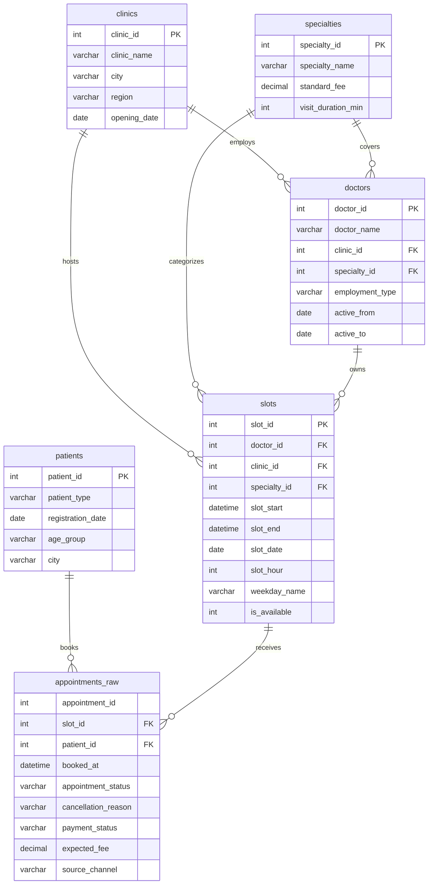

# Data Dictionary

## Schema overview

## Tables

### clinics

Medical locations in the private healthcare network.

| Column | Description |
| --- | --- |
| `clinic_id` | Clinic identifier. |
| `clinic_name` | Clinic name used in reporting. |
| `city` | Clinic city. |
| `region` | State or region. |
| `opening_date` | Clinic opening date. |

### specialties

Medical services offered by the network.

| Column | Description |
| --- | --- |
| `specialty_id` | Specialty identifier. |
| `specialty_name` | Specialty name. |
| `standard_fee` | Typical expected appointment fee. |
| `visit_duration_min` | Planned visit duration in minutes. |

### doctors

Doctors assigned to one clinic and one main specialty.

| Column | Description |
| --- | --- |
| `doctor_id` | Doctor identifier. |
| `doctor_name` | Synthetic doctor name. |
| `clinic_id` | Doctor's clinic. |
| `specialty_id` | Doctor's specialty. |
| `employment_type` | Full-time, part-time or contract. |
| `active_from` | Start date in the network. |
| `active_to` | End date if inactive. Blank means active. |

### patients

Synthetic patient dimension. No real personal data is used.

| Column | Description |
| --- | --- |
| `patient_id` | Patient identifier. |
| `patient_type` | `first_time` or `returning`. |
| `registration_date` | Date the patient registered. |
| `age_group` | Age band used for analysis. |
| `city` | Patient city. |

### slots

Available doctor appointment slots.

| Column | Description |
| --- | --- |
| `slot_id` | Slot identifier. |
| `doctor_id` | Doctor assigned to the slot. |
| `clinic_id` | Clinic where the slot is available. |
| `specialty_id` | Specialty for the slot. |
| `slot_start` | Slot start timestamp. |
| `slot_end` | Slot end timestamp. |
| `slot_date` | Slot date. |
| `slot_hour` | Start hour. |
| `weekday_name` | Weekday label. |
| `is_available` | Whether the slot was available for booking. |

### appointments_raw

Raw appointment booking feed. It can contain duplicate candidates, so `appointment_id` is not a primary key in the raw table.

| Column | Description |
| --- | --- |
| `appointment_id` | Source appointment identifier. |
| `slot_id` | Booked slot. |
| `patient_id` | Patient who booked. |
| `booked_at` | Booking timestamp. |
| `appointment_status` | Raw appointment status, before cleaning. |
| `cancellation_reason` | Reason if cancelled. |
| `payment_status` | Raw payment status. |
| `expected_fee` | Expected appointment fee, sometimes missing. |
| `source_channel` | Raw booking channel, before cleaning. |

## Main derived fields

| Field | View | Definition |
| --- | --- | --- |
| `booking_lead_days` | `v_appointments_clean` | Days between booking and appointment date. |
| `wait_time_days` | `v_appointments_clean` | Same business definition as booking lead time for this dataset. |
| `is_no_show` | `v_appointments_clean` | 1 when cleaned status is `no_show`. |
| `is_late_cancelled` | `v_appointments_clean` | 1 when the source system flagged a late cancellation. |
| `revenue_lost` | `v_appointments_clean` | Expected fee for no-shows and late cancellations. |
| `time_block` | `v_appointments_clean`, `v_slot_fact` | Morning, afternoon or evening from slot hour. |
| `is_booked` | `v_slot_fact` | 1 when an available slot has a cleaned appointment. |
| `is_unused` | `v_slot_fact` | 1 when an available slot has no appointment. |
